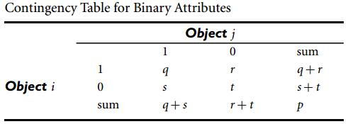
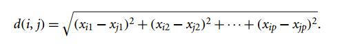
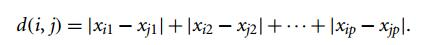
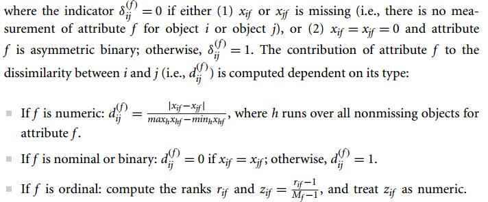

+++
title = "2_4_data_similarity"
date = 2018-11-11T18:57:18+08:00
draft = false

# Authors. Comma separated list, e.g. `["Bob Smith", "David Jones"]`.
authors = []

# Tags and categories
# For example, use `tags = []` for no tags, or the form `tags = ["A Tag", "Another Tag"]` for one or more tags.
tags = []
categories = []

# Projects (optional).
#   Associate this post with one or more of your projects.
#   Simply enter your project's folder or file name without extension.
#   E.g. `projects = ["deep-learning"]` references 
#   `content/project/deep-learning/index.md`.
#   Otherwise, set `projects = []`.
# projects = ["internal-project"]

# Featured image
# To use, add an image named `featured.jpg/png` to your page's folder. 
[image]
  # Caption (optional)
  caption = ""

  # Focal point (optional)
  # Options: Smart, Center, TopLeft, Top, TopRight, Left, Right, BottomLeft, Bottom, BottomRight
  focal_point = ""
+++

### 2.4 Measuring Data Similarity and Dissimilarity

Dada similarity is critical for many data mining applications, such as clustering,  outlier analysis, and nearest-neighobr classification.

- A store may want to cluster customers into groups with similar characteristics (e.g. income, area)

---

#### Proximity meatures for different data types

##### 1. Nominal Attribute

A nominal attribute example: map_color (red, blue, yellow...)
$$
simi(i,j) = \frac{m}{p}
$$
Where $m$ is the number of matches (e.g., the number of attributes for which i and j are in the same state) and $p$ is the total number of attributes

##### 2. Binary Attribute

A binary attribute example: gender (male or female)

**symmetric binary similarity** 
$$
simi(i,j) = \frac{q+t}{q+r+s+t}
$$
**asymmetric binary similarity (Jaccard coefficient)** (for situations where the agreement of a positive match is more significant, e.g. medical examination)
$$
simi(i,j)=\frac{q}{q+r+s}
$$

##### 3. Numeric Attribute

A numeric attribute example: height (1.6m, 1.8m,...)

**Euclidean distance**

**Manhattan (city block ) distance**

**Supremum(Chebyshev) distance**

**Minkowski distance**

Bothe *Euclidean distance* and *Manhattan distance* satisfy **Symmetry**, **Identity of indiscernibles**, **Triangle inequality**, which makes them ***metric***.

##### 4. Ordinal Attribute (attention!!)

The values of an ordinal attribute have a meanful ranking, but the *magnitude between successive values is unknown.* For example, size attribute (small, medium, large)

*first*, mapping ordinal attribute to numeric attribute (***why minus 1?***):
$$
z\_{if} = \frac{r\_{if}-1}{M\_f-1}
$$
Where $f$ is an ordinal attribute, $M\_f$ is the maximum ranking value, $r\_{if}$ is the ranking values of object $i$.

##### 5. Mixed data types

---

